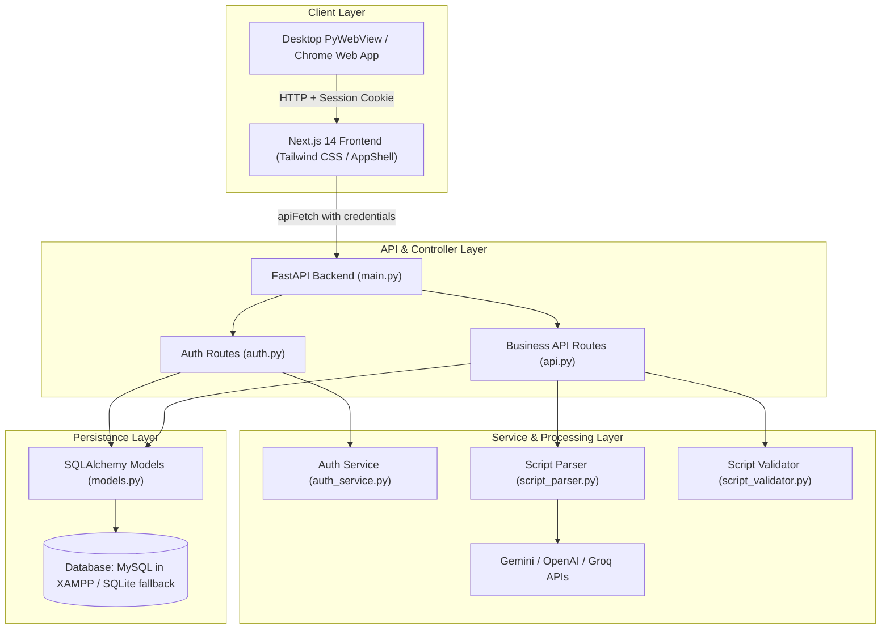

# ERytmo Script Converter v2 — Project Architecture & File Map

## 1. System Overview

**ERytmo Script Converter** is a dual-target application (Desktop PyWebView app + Web application) built with a **FastAPI (Python)** backend and a **Next.js 14 (TypeScript/Tailwind CSS)** frontend.

### Primary Capabilities:
1. **Script Parsing & Conversion**: Converts dialogue scripts (`.docx`, `.txt`, `.srt`, etc.) into dubbing rhythm strip formats (**Mosaic Excel** and **ERytmo Word** formats).
2. **AI-Powered Media Alignment**: Leverages multimodal LLMs (Google Gemini, OpenAI, Groq) along with FFmpeg to automatically synchronize dialogue lines with audio/video timecodes.
3. **Multi-Tenant Management Dashboard**:
   - **Company Management**: Client studios, contact information, and rate matrices (rates for détection, conformation, pose de texte, chantant).
   - **Project Management**: Deadlines, software targets, status, linked companies, and local folder file inspection.
   - **Staff Management**: Team roles, contact info, and linking with registered user accounts.
   - **Time & Earnings Tracker**: Tracks working hours per project and calculates earnings based on company rate cards.
   - **AI API Key Vault**: Scoped multi-key management with rotation and validation.
4. **Authentication & Multi-User Isolation**:
   - Secure registration, password hashing (bcrypt), 6-digit email OTP verification via SMTP, Google OAuth 2.0.
   - Strict backend database ownership (`user_id` foreign keys) guaranteeing 100% data isolation between users.

---

## 2. Architecture & Data Flow Diagram

---

## 3. Root Files Map

| File Path | Description |
| :--- | :--- |
| [`.env`](file:///e:/All%20Projects/convert%20script/.env) | Environment configuration containing active secrets: JWT secret, SMTP email credentials, Google OAuth client ID/secret, and MySQL/SQLite database connection strings. |
| [`.env.example`](file:///e:/All%20Projects/convert%20script/.env.example) | Template file showcasing all required environment variables and their default formats. |
| [`README.md`](file:///e:/All%20Projects/convert%20script/README.md) | High-level documentation detailing project overview, installation instructions, desktop app launch commands, and architecture. |
| [`test_data_isolation.py`](file:///e:/All%20Projects/convert%20script/test_data_isolation.py) | Comprehensive automated security test suite that verifies multi-tenant data isolation across Companies, Projects, Staff, Appointments, and API Keys. |
| [`Setup_ERytmo_Script_Converter.exe`](file:///e:/All%20Projects/convert%20script/Setup_ERytmo_Script_Converter.exe) | Standalone Windows installer for desktop deployment of the ERytmo suite. |
| [`ERytmo_V2.lnk`](file:///e:/All%20Projects/convert%20script/ERytmo_V2.lnk) | Windows shortcut to launch the desktop application executable. |
| [`migrate_companies.py`](file:///e:/All%20Projects/convert%20script/migrate_companies.py) | Standalone migration script adding rate columns and contact fields to SQLite `companies` table. |
| [`migrate_projects.py`](file:///e:/All%20Projects/convert%20script/migrate_projects.py) | Standalone migration script adding `total_time` to SQLite `projects` table. |
| [`list_models.py`](file:///e:/All%20Projects/convert%20script/list_models.py) | Diagnostic script to test Google Gemini API connectivity and list available model versions. |
| [`find_missing_translations.py`](file:///e:/All%20Projects/convert%20script/find_missing_translations.py) | Quality assurance utility checking for missing keys between English, French, and Arabic translation dictionaries. |
| [`en_DIALOG_LIST-MySesameStreetFriends-....xlsx`](file:///e:/All%20Projects/convert%20script/en_DIALOG_LIST-MySesameStreetFriends-MySesameStreetFriendsMyElmoEpisode33Weather-en-V1-Final_Cut-v4.0%20(1).xlsx) | Sample dialogue list spreadsheet used to test Mosaic conversion and cue extraction. |

---

## 4. Backend File Map (`backend/`)

### Core Application
| File Path | Description |
| :--- | :--- |
| [`backend/app.py`](file:///e:/All%20Projects/convert%20script/backend/app.py) | Desktop entry point. Starts FastAPI in a daemon thread, launches a native `pywebview` window with a custom user-agent and session storage, and opens native Chrome for 1-click Google OAuth. |
| [`backend/main.py`](file:///e:/All%20Projects/convert%20script/backend/main.py) | FastAPI application factory. Registers CORS middlewares, mounts authentication and API routers, serves static Next.js frontend export from `frontend/out/`, and hosts Google OAuth callback pages. |
| [`backend/requirements.txt`](file:///e:/All%20Projects/convert%20script/backend/requirements.txt) | Python dependencies list including FastAPI, SQLAlchemy, PyMySQL, pywebview, PyJWT, passlib, openpyxl, python-docx, and Google GenAI SDK. |
| [`backend/config.json`](file:///e:/All%20Projects/convert%20script/backend/config.json) | Legacy local JSON file holding fallback API keys migrated into the database. |

### Database Layer (`backend/database/`)
| File Path | Description |
| :--- | :--- |
| [`backend/database/database.py`](file:///e:/All%20Projects/convert%20script/backend/database/database.py) | Database connection engine. Automatically detects XAMPP MySQL (auto-creating `erytmo_db` if needed) and falls back to SQLite. Runs non-destructive schema migrations and safe assignment of legacy records. |
| [`backend/database/erytmo.db`](file:///e:/All%20Projects/convert%20script/backend/database/erytmo.db) | Embedded SQLite database file used when MySQL is offline. |
| [`backend/database/erytmo_mysql_schema.sql`](file:///e:/All%20Projects/convert%20script/backend/database/erytmo_mysql_schema.sql) | Complete SQL DDL schema for MySQL/MariaDB with utf8mb4 encoding, foreign keys, and indexes for multi-user isolation. |
| [`backend/database/migrate_sqlite_to_mysql.py`](file:///e:/All%20Projects/convert%20script/backend/database/migrate_sqlite_to_mysql.py) | Migration tool to transfer existing records from SQLite into MySQL/MariaDB. |

### Models Layer (`backend/models/`)
| File Path | Description |
| :--- | :--- |
| [`backend/models/models.py`](file:///e:/All%20Projects/convert%20script/backend/models/models.py) | SQLAlchemy ORM definitions for `User`, `EmailVerification`, `RevokedToken`, `Company`, `Project`, `Script`, `Appointment`, `Staff`, and `ApiKey`, defining user ownership foreign keys and cascade relationships. |

### Routes Layer (`backend/routes/`)
| File Path | Description |
| :--- | :--- |
| [`backend/routes/auth.py`](file:///e:/All%20Projects/convert%20script/backend/routes/auth.py) | Complete auth router: Registration, login with JWT cookies/bearer tokens, 6-digit email OTP verification, Google OAuth 2.0 flow, token revocation (logout), and profile management (`/api/auth/me`). |
| [`backend/routes/api.py`](file:///e:/All%20Projects/convert%20script/backend/routes/api.py) | Main business logic API router: Scoped CRUD for Companies, Projects, Staff, Appointments, and API Keys; folder dialog browsing; file streaming; script conversion; media alignment; and export download. |

### Services Layer (`backend/services/`)
| File Path | Description |
| :--- | :--- |
| [`backend/services/auth_service.py`](file:///e:/All%20Projects/convert%20script/backend/services/auth_service.py) | Cryptographic security and communication service: generates 6-digit verification codes, hashes codes/passwords, and sends verification emails via Gmail SMTP with responsive HTML templates. |
| [`backend/services/script_parser.py`](file:///e:/All%20Projects/convert%20script/backend/services/script_parser.py) | Core conversion engine: parses scripts locally or through AI (Gemini/OpenAI/Groq), generates Mosaic Excel sheets with openpyxl, formats Word documents with python-docx, and aligns timecodes using Gemini multimodal video processing. |
| [`backend/services/script_validator.py`](file:///e:/All%20Projects/convert%20script/backend/services/script_validator.py) | Script verification service: checks file readability, detects cue structures/timecodes, and returns validation reports with action suggestions. |

### Legacy Desktop & Assets (`backend/src/`)
| File Path | Description |
| :--- | :--- |
| [`backend/src/main_gui.py`](file:///e:/All%20Projects/convert%20script/backend/src/main_gui.py) | Legacy Tkinter desktop interface used before migration to the modern Next.js v2 UI. |
| [`backend/src/exceptions.py`](file:///e:/All%20Projects/convert%20script/backend/src/exceptions.py) | Custom exception classes for script parsing and validation errors. |
| [`backend/src/generate_logo.py`](file:///e:/All%20Projects/convert%20script/backend/src/generate_logo.py) | Script to generate application `.ico` and `.png` icons with custom dimensions and styling. |
| [`backend/src/*.spec`](file:///e:/All%20Projects/convert%20script/backend/src/) | PyInstaller build specification files for compiling the Python desktop application. |

---

## 5. Frontend File Map (`frontend/`)

### Configuration & Tooling
| File Path | Description |
| :--- | :--- |
| [`frontend/package.json`](file:///e:/All%20Projects/convert%20script/frontend/package.json) | Node.js project manifest defining dependencies (Next.js 14, React 18, Lucide icons, Tailwind CSS) and build scripts (`dev`, `build`, `start`, `lint`). |
| [`frontend/next.config.mjs`](file:///e:/All%20Projects/convert%20script/frontend/next.config.mjs) | Next.js configuration enabling static HTML export (`output: 'export'`) so the frontend bundle is directly hosted by FastAPI. |
| [`frontend/tailwind.config.ts`](file:///e:/All%20Projects/convert%20script/frontend/tailwind.config.ts) | Tailwind CSS design system configuration defining dark mode, custom color palettes, and container styles. |
| [`frontend/tsconfig.json`](file:///e:/All%20Projects/convert%20script/frontend/tsconfig.json) | TypeScript configuration mapping `@/*` alias to the `frontend/src/*` directory. |
| [`frontend/.env.local`](file:///e:/All%20Projects/convert%20script/frontend/.env.local) | Frontend environment variables, such as Google Client ID and API endpoint fallbacks. |

### State Management & Contexts (`frontend/src/context/`)
| File Path | Description |
| :--- | :--- |
| [`frontend/src/context/AuthContext.tsx`](file:///e:/All%20Projects/convert%20script/frontend/src/context/AuthContext.tsx) | Global authentication provider. Manages authenticated `user` state, verifies session cookies on boot, and provides `login()`, `register()`, `loginWithGoogle()`, `verifyEmail()`, and `logout()`. |
| [`frontend/src/context/SettingsContext.tsx`](file:///e:/All%20Projects/convert%20script/frontend/src/context/SettingsContext.tsx) | User preferences provider: manages Dark/Light theme switching, language selection (English, French, Arabic), and provides translation function `t()`. |
| [`frontend/src/context/ConverterContext.tsx`](file:///e:/All%20Projects/convert%20script/frontend/src/context/ConverterContext.tsx) | Script converter workflow state: stores the active uploaded file, parsed cues, alignment results, and export preferences. |

### Utilities & Localization (`frontend/src/lib/`, `frontend/src/i18n/`)
| File Path | Description |
| :--- | :--- |
| [`frontend/src/lib/api.ts`](file:///e:/All%20Projects/convert%20script/frontend/src/lib/api.ts) | Centralized fetch wrapper (`apiFetch`). Guarantees `credentials: "include"` for HttpOnly authentication cookie transmission across PyWebView and web browsers. |
| [`frontend/src/i18n/translations.ts`](file:///e:/All%20Projects/convert%20script/frontend/src/i18n/translations.ts) | Complete localization dictionary for English (`en`), French (`fr`), and Arabic (`ar`), supporting bidirectional layout (LTR/RTL). |

### UI Components (`frontend/src/components/`)
| File Path | Description |
| :--- | :--- |
| [`frontend/src/components/AppShell.tsx`](file:///e:/All%20Projects/convert%20script/frontend/src/components/AppShell.tsx) | Responsive application layout wrapper. Manages the top header, sidebar navigation, theme toggle, language switcher, user profile badge, and main content area. |
| [`frontend/src/components/Sidebar.tsx`](file:///e:/All%20Projects/convert%20script/frontend/src/components/Sidebar.tsx) | Main sidebar navigation containing links to Converter, Projects, Companies, Staff, Dashboard, and Settings with active indicator states. |
| [`frontend/src/components/ApiKeyManager.tsx`](file:///e:/All%20Projects/convert%20script/frontend/src/components/ApiKeyManager.tsx) | Reusable management component for Gemini, OpenAI, and Groq API keys with masked display, live validation, add, toggle, and delete actions. |
| [`frontend/src/components/GoogleAuthButton.tsx`](file:///e:/All%20Projects/convert%20script/frontend/src/components/GoogleAuthButton.tsx) | Custom Google sign-in button. Automatically uses native Chrome on desktop PyWebView and Google Identity Services in web mode. |
| [`frontend/src/components/ConfirmModal.tsx`](file:///e:/All%20Projects/convert%20script/frontend/src/components/ConfirmModal.tsx) | Accessible confirmation dialog for edit and delete actions across all CRUD pages. |
| [`frontend/src/components/CustomSelect.tsx`](file:///e:/All%20Projects/convert%20script/frontend/src/components/CustomSelect.tsx) | Custom styled dropdown select element with dark mode support. |

### Application Pages (`frontend/src/app/`)
| File Path | Description |
| :--- | :--- |
| [`frontend/src/app/layout.tsx`](file:///e:/All%20Projects/convert%20script/frontend/src/app/layout.tsx) | Root application layout. Injects Google fonts (Plus Jakarta Sans), AppShell, and Context Providers (Auth, Settings, Converter). |
| [`frontend/src/app/globals.css`](file:///e:/All%20Projects/convert%20script/frontend/src/app/globals.css) | Global stylesheet with Tailwind directives, custom scrollbars, and keyframe animations. |
| [`frontend/src/app/page.tsx`](file:///e:/All%20Projects/convert%20script/frontend/src/app/page.tsx) | **Dashboard / Time Tracker**: Project time log with automatic earnings calculation using linked company rates and user-scoped local storage. |
| [`frontend/src/app/converter/page.tsx`](file:///e:/All%20Projects/convert%20script/frontend/src/app/converter/page.tsx) | **Script Converter Page**: Upload documents, extract structured cues (in/out/character/dialogue), perform Gemini AI media alignment, preview dialogue tables, and download Mosaic (`.xlsx`) or Word (`.docx`). |
| [`frontend/src/app/company/page.tsx`](file:///e:/All%20Projects/convert%20script/frontend/src/app/company/page.tsx) | **Company Management Page**: Full CRUD interface for client studios, rate configuration (detection, conformation, text placement, singing), and contact emails. |
| [`frontend/src/app/projects/page.tsx`](file:///e:/All%20Projects/convert%20script/frontend/src/app/projects/page.tsx) | **Projects Management Page**: Manage projects, set deadlines and software targets, select company, browse local folder, and inspect detected video and script files. |
| [`frontend/src/app/staff/page.tsx`](file:///e:/All%20Projects/convert%20script/frontend/src/app/staff/page.tsx) | **Staff Management Page**: Manage team members, designate tasks, and link staff members to registered user accounts using live search. |
| [`frontend/src/app/login/page.tsx`](file:///e:/All%20Projects/convert%20script/frontend/src/app/login/page.tsx) | **Login Screen**: Authenticate with email/password (with "Remember Me") or "Continue with Google". Handles unverified account redirection. |
| [`frontend/src/app/register/page.tsx`](file:///e:/All%20Projects/convert%20script/frontend/src/app/register/page.tsx) | **Registration Screen**: First name, last name, email, phone number, and password with real-time validation checks. |
| [`frontend/src/app/verify-email/page.tsx`](file:///e:/All%20Projects/convert%20script/frontend/src/app/verify-email/page.tsx) | **Email OTP Verification Screen**: 6-box OTP entry for the code sent via SMTP, with resend cooldown timer. |
| [`frontend/src/app/settings/page.tsx`](file:///e:/All%20Projects/convert%20script/frontend/src/app/settings/page.tsx) | **Settings Hub**: Global theme (Light/Dark), Language switcher, and links to AI provider key managers. |
| [`frontend/src/app/settings/gemini/page.tsx`](file:///e:/All%20Projects/convert%20script/frontend/src/app/settings/gemini/page.tsx) | Google Gemini API key configuration screen. |
| [`frontend/src/app/settings/openai/page.tsx`](file:///e:/All%20Projects/convert%20script/frontend/src/app/settings/openai/page.tsx) | OpenAI API key configuration screen. |
| [`frontend/src/app/settings/groq/page.tsx`](file:///e:/All%20Projects/convert%20script/frontend/src/app/settings/groq/page.tsx) | Groq API key configuration screen. |
